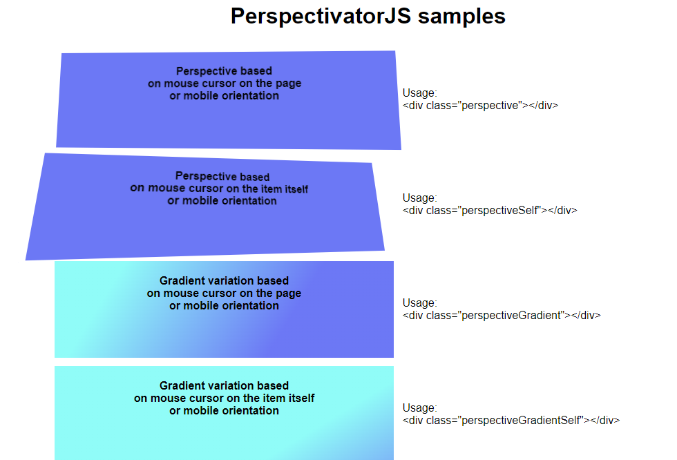

# PerspectivatorJS
Lightweight Perspective and Gradient effect based on mouse movement or device orientation in pure Javascript

Perspective and Gradient variations are using mouse movement over the page (or the html element itself).

If the device support "motion" (like phone, tablet with accelerometer), variations will be based on device rotation rate.

# Samples
Have look at this [samples page](http://vincentguigui.github.io/PerspectivatorJS/samples.html) to see how it looks.


# Usage

## 1. Include the script 
Include the script in your page either in the HEAD tag using defer or at the bottom of the page:
```
<script src="PerspectivatorJS.js" type="text/javascript" defer></script>
```
or
```
<script src="https://cdn.jsdelivr.net/gh/VincentGuigui/PerspectivatorJS@1.0/perspectivator.js" type="text/javascript" defer></script>
```

## 2. Add the right CSS class to your visual element

Choose the element you want to add dynamic perspective to (eg: DIV, IMG, ...)
For example:
```
<div id="myDiv" class="myClass" style="...">content</div>
```
Add the Perspectivator classes to get the desired effect:
For example perspectiveGradient to make a gradient variation:
```
<div id="myDiv" class="myClass perspectiveGradient" style="...">content</div>
```

### For Perspective variation

**Perspective angles** will be based on mouse cursor movement (mousemove event) or mobile orientation (deviceMotion event).

Two perspective computations are possible:
- page-based perspective: Perspective changes based on mouse movement over the whole page
- element-based perspective: Perspective changes based on mouse movement on the element itself

Add one of the following classes to the element to get the desired effect.

| Class | Effect |
| --- | --- |
| **perspective** | Page-based perspective |
| **perspectiveSelf** | Element-based perspective |

On mobile (motion enabled device) **perspective** and **perspectiveSelf** have the same behavior.

### For Gradient variation

**Gradient effect will shift and rotate** based on mouse cursor movement (mousemove event) or mobile orientation (deviceMotion event). 

It required an existing linear-gradient with 2 colors on the background-image of the element. Define a gradient either using inline-style or CSS:

```
background-image: linear-gradient(ANGLE, START_COLOR STOP1, END_COLOR STOP2);

eg:
background-image: linear-gradient(45deg, rgb(156, 252, 248) 20%, rgb(110, 123, 251) 80%);
```

Two gradient computations are possible:
- page-based gradient: Gradient moves based on mouse movement over the whole page
- element-based gradient: Gradient moves based on mouse movement on the element itself

Add one of the following classes to the element to get the desired effect.

| Class | Effect |
| --- | --- |
| **perspectiveGradient** |  Page-based gradient |
| **perspectiveGradientSelf** | Element-based gradient |

On mobile (motion enabled device) **perspectiveGradient** and **perspectiveGradientSelf** have the same behavior.

### Notes: 
- You can combine **perspective** and **perspectiveGradient**.
- You can't combine **perspective** and **perspectiveSelf** or **perspectiveGradient** and **perspectiveGradientSelf**

## 3. Perspectivator options

Declare an object ``window.PerspectivatorOptions`` with one of the following options to customize Perspectivator behavior.

| Options | Default value | Use |
| --- | --- | --- |
| motionEnabled | true | to enable or disable control through device motion |
| interactionSurface | window | actual HTML element from which the mouse movement will be capture |
| perspectiveClassName | "perspective" | class name to use on element for page-based perspective |
| perspectiveGradientClassName | "perspectiveGradient" | class name to use on element for page-based gradient |
| perspectiveSelfClassName | "perspectiveSelf" | class name to use on element for element-based perspective |
| perspectiveGradientSelfClassName  | "perspectiveGradientSelf" | class name to use on element for element-based gradient |
| transition | "transform 0.3s cubic-bezier(0.215, 0.61, 0.344, 0.6)" | transition to use to go back to initial state (mouseout or no motion) |
| perspectiveDistance | "800px" | perspective intensity: less than 50px is exagerated, more than 2500px is too discreet |
| amplitudeX | 10 | maximum rotation along the horizontal line |
| amplitudeY | 10 | maximum rotation along the vertical line |
| motionAttenuation | 120 | smoothness of the rotation using device motion |


eg:
```
<script type="text/javascript" defer>
	window.PerspectivatorOptions = {
		perspectiveDistance: "200px",
		perspectiveClassName: "myOwnClassNameForPerspective",
		motionEnabled: false
</script>
```
